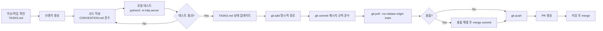

# CONTRIBUTING — 콜라보레이션 가이드

> 프로젝트: Kanban Board  
> 작성일: 2026-05-20

---

## 1. 시작하기

### 1.1 로컬 실행

외부 파일(CSS/JS)을 참조하므로 **반드시 로컬 서버**로 실행하세요.

```bash
# 프로젝트 디렉터리로 이동
cd src/exercise/kangsoo.lee/day03/kanban

# Python 로컬 서버 실행
python3 -m http.server 8765
```

브라우저에서 `http://localhost:8765` 접속.  
WSL 환경: Windows 브라우저에서도 동일 URL 동작.

### 1.2 파일 구조 이해

```
kanban/
├── index.html       ← HTML 골격 (마크업 전용)
├── style.css        ← 모든 스타일
├── app.js           ← 모든 로직
├── PLAN.md          ← 개발 계획
├── PRD.md           ← 제품 요구사항 정의서
├── TRD.md           ← 기술 요구사항 + 흐름도 + ERD
├── DESIGN_SYSTEM.md ← 디자인 시스템
├── TASKS.md         ← 작업 목록
├── CONVENTION.md    ← 코딩 컨벤션
└── CONTRIBUTING.md  ← 이 파일
```

---

## 2. 브랜치 전략

이 저장소는 **공유 모노레포**입니다. 아래 규칙을 엄수하세요.

### 2.1 브랜치 네이밍

```
feat/kangsoo.lee/day03-<feature-name>
fix/kangsoo.lee/day03-<bug-name>
docs/kangsoo.lee/day03-<doc-name>
```

예시:
```
feat/kangsoo.lee/day03-inline-edit
fix/kangsoo.lee/day03-drop-duplicate
docs/kangsoo.lee/day03-prd
```

### 2.2 금지 사항

| 행동 | 이유 |
|------|------|
| `git rebase` | 다른 참가자의 커밋 해시 파괴 |
| `git push --force` | 원격 히스토리 훼손 |
| `git pull --rebase` | 저장소 정책 위반 |
| `git add -A` | 타 참가자 파일 실수 포함 가능 |

### 2.3 올바른 동기화

```bash
# pull은 항상 merge로
git pull --no-rebase origin main

# 충돌 발생 시: merge 커밋 안에서 해결
# 절대 rebase로 전환하지 않음
```

### 2.4 스테이징 — 명시적 경로 사용

```bash
# 좋음: 본인 디렉터리만 명시
git add src/exercise/kangsoo.lee/day03/kanban/

# 나쁨: 전체 추가 (타인 파일 섞임)
git add -A
git add .
```

---

## 3. 작업 흐름 (Workflow)



---

## 4. PR (Pull Request) 가이드

### 4.1 PR 제목

```
[day03/kanban] <타입>: <한 줄 요약>
```

예시:
```
[day03/kanban] feat: 카드 인라인 편집 기능 추가
[day03/kanban] fix: 같은 칼럼 드롭 시 중복 삽입 수정
[day03/kanban] docs: PRD/TRD 문서 추가
```

### 4.2 PR 본문 템플릿

```markdown
## 변경 사항
- 무엇을 변경했는지 bullet point로 기술

## 변경 이유
- 왜 이 변경이 필요한지

## 테스트 방법
1. python3 -m http.server 8765 실행
2. http://localhost:8765 접속
3. ...

## 체크리스트
- [ ] CONVENTION.md 규칙 준수
- [ ] 크로스브라우저 테스트 (Chrome / Firefox / Safari)
- [ ] 모바일 뷰 확인 (320px)
- [ ] XSS 입력 테스트
- [ ] TASKS.md 상태 업데이트
```

### 4.3 PR 크기

| 크기 | 기준 | 권장 |
|------|------|------|
| Small | ≤ 50줄 변경 | 즉시 머지 가능 |
| Medium | 50~200줄 | 기능 단위로 분리 권장 |
| Large | 200줄 초과 | 반드시 분리 요청 |

---

## 5. 코드 리뷰 가이드

### 5.1 리뷰어 체크 항목

```
□ 기능 요구사항(PRD)과 일치하는가?
□ CONVENTION.md 규칙을 따르는가?
□ XSS 취약점 없는가? (textContent 사용 여부)
□ try/catch 빠진 JSON 파싱 없는가?
□ 새 CSS 클래스가 DESIGN_SYSTEM.md와 충돌하지 않는가?
□ 불필요한 console.log 남아 있지 않은가?
□ 파일 범위가 kangsoo.lee/day03/kanban/ 내부인가?
```

### 5.2 리뷰 커뮤니케이션 원칙

| 접두사 | 의미 |
|--------|------|
| `[필수]` | 반드시 수정 후 머지 |
| `[권장]` | 수정 권장, 작성자 판단 |
| `[질문]` | 이해를 위한 질문, 수정 불필요 |
| `[칭찬]` | 좋은 코드 언급 |

---

## 6. 테스트 체크리스트

작업 완료 전 아래 항목을 수동으로 확인하세요.

### 6.1 기능 테스트

```
□ To-Do / In-Progress / Done 세 칼럼이 표시된다
□ 각 칼럼에서 카드 추가 → 배지 카운트 증가
□ Enter 키로 카드 추가 (Shift+Enter는 추가 안 됨)
□ 빈 텍스트 입력 시 카드 추가 안 됨
□ ✕ 버튼 클릭 → 카드 삭제 → 배지 카운트 감소
□ 카드 드래그 → 다른 칼럼 드롭 → 이동 성공
□ 같은 칼럼 드롭 → 무시 (카드 복제/이동 없음)
□ 새로고침 후 카드 목록 유지 (localStorage)
```

### 6.2 보안 테스트

```
□ 카드 텍스트: <script>alert(1)</script> 입력 → 스크립트 실행 안 됨
□ 카드 텍스트:  입력 → 실행 안 됨
□ localStorage 값 수동 변조(JSON 깨기) 후 새로고침 → 빈 보드, 크래시 없음
```

### 6.3 UI 테스트

```
□ Chrome 최신 버전
□ Firefox 최신 버전
□ Safari 최신 버전 (macOS 또는 iOS)
□ 모바일 뷰 320px — 칼럼이 세로로 쌓이고 잘리지 않음
□ 드래그 중 소스 카드 반투명 표시
□ 드롭 대상 칼럼 파란 점선 강조
```

---

## 7. 자주 묻는 질문 (FAQ)

**Q. `file://`로 열었더니 CSS/JS가 적용 안 됩니다.**  
A. 외부 파일 참조는 보안 정책으로 차단됩니다. `python3 -m http.server 8765` 로컬 서버를 사용하세요.

**Q. 다른 참가자 폴더의 충돌이 발생했습니다.**  
A. 정상입니다. `git pull --no-rebase` 중 발생하는 타 참가자 파일 머지는 그대로 수락하세요. 절대 파일을 삭제하거나 변경하지 마세요.

**Q. localStorage 데이터를 초기화하고 싶습니다.**  
A. 브라우저 개발자도구 → Application → Local Storage → `kanban` 키 삭제.

**Q. 카드가 100개 넘어도 괜찮나요?**  
A. 기능 동작은 가능하지만 렌더링이 느려질 수 있습니다. v1.1에서 가상화 또는 페이지네이션 계획 중입니다. (TASKS.md T-201 참조)
