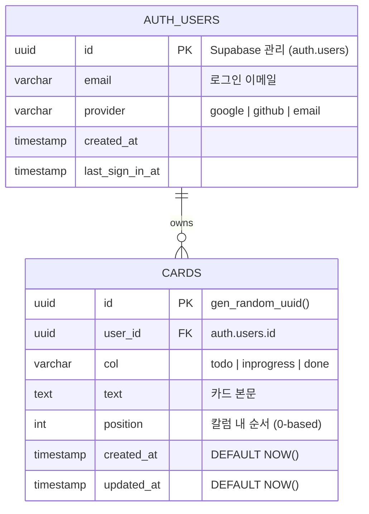
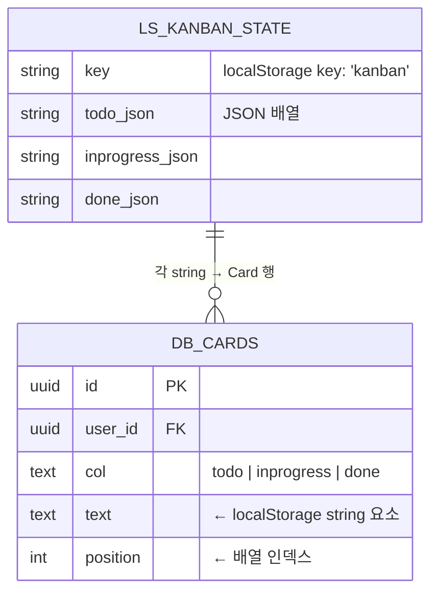

# DATABASE — 데이터베이스 설계

> 프로젝트: Kanban Board  
> 작성일: 2026-05-20  
> 작성자: Kangsoo.Lee  
> 대상 DB: Supabase PostgreSQL 15+

---

## 변경 이력

| 버전 | 날짜 | 변경 내용 |
|------|------|-----------|
| 1.0.0 | 2026-05-20 | 최초 작성 — localStorage 기반 설계 |
| 2.0.0 | 2026-05-20 | Supabase PostgreSQL 실제 구현 반영, RLS 정책 추가 |

---

## 1. 현재 구조 vs 확장 구조

| 구분 | v1.0 (이전) | v2.0 (현재) |
|------|-------------|-------------|
| 저장소 | `localStorage` (브라우저) | Supabase PostgreSQL |
| 사용자 | 단일 / 익명 | 다중 / 인증 (Google·GitHub·이메일) |
| 보드 수 | 1개 고정 | 사용자별 1개 (확장 가능) |
| 실시간 | 없음 | Supabase Realtime (미사용, 향후 추가 가능) |
| 백업 | 없음 | Supabase 자동 백업 |
| 데이터 격리 | 없음 | RLS (Row Level Security) |

---

## 2. v2.0 실제 구현 ERD



---

## 3. DDL — cards 테이블

```sql
-- cards 테이블 생성
CREATE TABLE public.cards (
  id         UUID        PRIMARY KEY DEFAULT gen_random_uuid(),
  user_id    UUID        NOT NULL REFERENCES auth.users(id) ON DELETE CASCADE,
  col        TEXT        NOT NULL CHECK (col IN ('todo', 'inprogress', 'done')),
  text       TEXT        NOT NULL,
  position   INTEGER     NOT NULL DEFAULT 0,
  created_at TIMESTAMPTZ NOT NULL DEFAULT NOW(),
  updated_at TIMESTAMPTZ NOT NULL DEFAULT NOW()
);

-- updated_at 자동 갱신 트리거
CREATE OR REPLACE FUNCTION update_updated_at()
RETURNS TRIGGER AS $$
BEGIN
  NEW.updated_at = NOW();
  RETURN NEW;
END;
$$ LANGUAGE plpgsql;

CREATE TRIGGER cards_updated_at
  BEFORE UPDATE ON public.cards
  FOR EACH ROW EXECUTE FUNCTION update_updated_at();
```

---

## 4. RLS (Row Level Security)

```sql
-- RLS 활성화
ALTER TABLE public.cards ENABLE ROW LEVEL SECURITY;

-- SELECT: 본인 카드만 조회
CREATE POLICY "cards_select_own" ON public.cards
  FOR SELECT USING (auth.uid() = user_id);

-- INSERT: 본인 user_id로만 삽입
CREATE POLICY "cards_insert_own" ON public.cards
  FOR INSERT WITH CHECK (auth.uid() = user_id);

-- UPDATE: 본인 카드만 수정
CREATE POLICY "cards_update_own" ON public.cards
  FOR UPDATE USING (auth.uid() = user_id);

-- DELETE: 본인 카드만 삭제
CREATE POLICY "cards_delete_own" ON public.cards
  FOR DELETE USING (auth.uid() = user_id);
```

> **RLS 설명**: anon key가 클라이언트에 노출되어도 다른 사용자 데이터에 접근 불가.  
> `auth.uid()`는 Supabase가 JWT 토큰에서 추출한 현재 로그인 사용자 ID.

---

## 5. 인덱스 설계

```sql
-- 사용자별 카드 조회 최적화
CREATE INDEX idx_cards_user_col_pos
  ON public.cards (user_id, col, position);

-- 카드 삭제/수정 시 ID 조회 (PK 인덱스로 충분)
-- created_at 기반 정렬 (추후 필요 시)
CREATE INDEX idx_cards_created
  ON public.cards (user_id, created_at DESC);
```

---

## 6. Supabase Auth 설정 (대시보드)

### 6.1 활성화할 Provider

| Provider | 설정 위치 | 필요 정보 |
|----------|-----------|-----------|
| Email | Authentication → Providers → Email | 기본 활성화 |
| Google | Authentication → Providers → Google | Client ID, Client Secret |
| GitHub | Authentication → Providers → GitHub | Client ID, Client Secret |

### 6.2 Redirect URL 등록

Supabase 대시보드 → **Authentication → URL Configuration** → Redirect URLs에 추가:

```
https://sarangks2-commits.github.io/kanban/
http://localhost:8765/
```

### 6.3 Site URL 설정

```
https://sarangks2-commits.github.io/kanban/
```

---

## 7. 마이그레이션 경로 (v1.0 localStorage → v2.0 Supabase)



**마이그레이션 스크립트 예시:**

```javascript
const ls = JSON.parse(localStorage.getItem('kanban') || '{}');
const rows = [];
['todo', 'inprogress', 'done'].forEach(col => {
  (ls[col] || []).forEach((text, position) => {
    rows.push({ user_id: currentUser.id, col, text, position });
  });
});
await sb.from('cards').insert(rows);
localStorage.removeItem('kanban');
```

---

## 8. 관계 요약

| 관계 | 카디널리티 | 설명 |
|------|------------|------|
| AUTH_USERS → CARDS | 1 : N | 한 사용자가 여러 카드 소유 |
| CARDS.col | ENUM | todo / inprogress / done 세 값만 허용 |
| CARDS.position | 정렬 기준 | 칼럼 내 카드 순서 |
