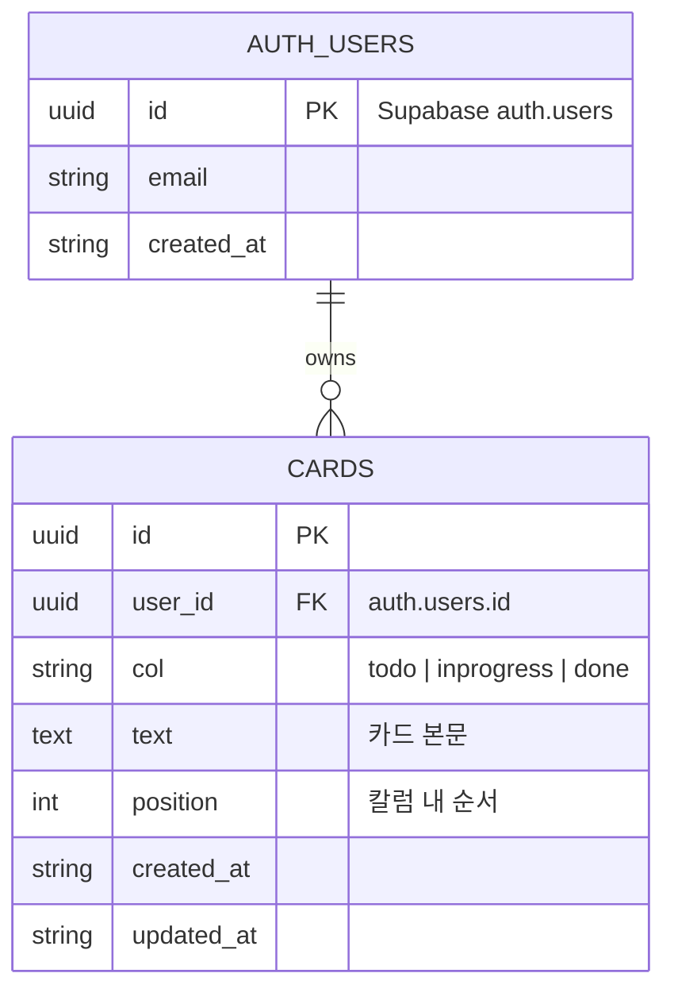

# TRD — 기술 요구사항 정의서
# Kanban Board Web Application

> 버전: 2.0.0  
> 작성일: 2026-05-20  
> 작성자: Kangsoo.Lee  
> 상태: 승인됨

---

## 변경 이력

| 버전 | 날짜 | 변경 내용 |
|------|------|-----------|
| 1.0.0 | 2026-05-20 | 최초 작성 — localStorage 기반 |
| 2.0.0 | 2026-05-20 | Supabase Auth + DB 연동, GitHub Pages 배포 |

---

## 1. 기술 스택

| 레이어 | 기술 | 버전 | 비고 |
|--------|------|------|------|
| 마크업 | HTML5 | — | Semantic 태그 사용 |
| 스타일 | CSS3 | — | Flexbox, Custom Properties |
| 로직 | Vanilla JS | ES2020+ | 빌드 도구 없음 |
| 인증 | Supabase Auth | v2 | Google / GitHub / Email |
| 저장소 | Supabase PostgreSQL | v15+ | `cards` 테이블, RLS 적용 |
| SDK | @supabase/supabase-js | 2.x | CDN (jsDelivr) |
| 드래그 | HTML5 DnD API | — | `dataTransfer` |
| 배포 | GitHub Pages | — | 정적 파일, HTTPS |
| 서버 | 없음 | — | BaaS(Supabase)로 대체 |

---

## 2. 아키텍처 개요

```
브라우저 (GitHub Pages)
│
├── index.html          ← 진입점 / 인증 화면 + 보드 DOM 골격
├── style.css           ← 프레젠테이션 레이어 (인증 + 보드)
└── app.js              ← 애플리케이션 레이어
        │
        ├── Supabase Client   ← createClient(URL, ANON_KEY)
        ├── Auth              ← OAuth / Email / Session 관리
        ├── DB (cards table)  ← CRUD via Supabase JS SDK
        ├── Render            ← State → DOM 완전 재렌더
        └── Events            ← 사용자 액션 → DB 변경 → Render
```

**단방향 데이터 흐름:**
```
User Action → Handler → Supabase DB mutate → loadCards() → render()
```

---

## 3. 인증 흐름

### 3.1 OAuth (Google / GitHub)

```
사용자 → OAuth 버튼 클릭
       → signInWithOAuth({ provider, redirectTo })
       → 공급자 동의 화면
       → redirectTo URL로 리다이렉트 (access_token 포함)
       → onAuthStateChange 콜백 발동
       → session.user 확인 → showBoard() → loadCards()
```

### 3.2 이메일 회원가입

```
사용자 → 이메일/비밀번호 입력 → signUp()
       → 확인 이메일 발송
       → 링크 클릭 → 세션 생성
       → onAuthStateChange → showBoard()
```

### 3.3 이메일 로그인

```
사용자 → 이메일/비밀번호 입력 → signInWithPassword()
       → 성공 시 session 반환
       → onAuthStateChange → showBoard() → loadCards()
```

### 3.4 세션 복원

```
페이지 로드
→ onAuthStateChange 자동 발동
→ 기존 세션 있음 → showBoard() → loadCards()
→ 없음 → showAuth()
```

---

## 4. 데이터 모델

### 4.1 Supabase `cards` 테이블

```sql
CREATE TABLE cards (
  id         UUID PRIMARY KEY DEFAULT gen_random_uuid(),
  user_id    UUID NOT NULL REFERENCES auth.users(id) ON DELETE CASCADE,
  col        TEXT NOT NULL CHECK (col IN ('todo', 'inprogress', 'done')),
  text       TEXT NOT NULL,
  position   INTEGER NOT NULL DEFAULT 0,
  created_at TIMESTAMPTZ DEFAULT NOW(),
  updated_at TIMESTAMPTZ DEFAULT NOW()
);

-- RLS 활성화
ALTER TABLE cards ENABLE ROW LEVEL SECURITY;

-- 사용자별 격리 정책
CREATE POLICY "user_own_cards" ON cards
  USING (auth.uid() = user_id)
  WITH CHECK (auth.uid() = user_id);
```

### 4.2 런타임 State 구조

```typescript
interface Card {
  id:   string;   // UUID
  text: string;   // 카드 본문
}

interface KanbanState {
  todo:       Card[];
  inprogress: Card[];
  done:       Card[];
}
```

---

## 5. 데이터베이스 ERD

> 상세 ERD → **[DATABASE.md](DATABASE.md)**



---

## 6. 핵심 함수 명세

| 함수 | 서명 | 역할 |
|------|------|------|
| `signInWithGoogle` | `() → Promise` | Google OAuth 시작 |
| `signInWithGitHub` | `() → Promise` | GitHub OAuth 시작 |
| `handleEmailLogin` | `() → Promise` | 이메일/비밀번호 로그인 |
| `handleEmailSignup` | `() → Promise` | 이메일 회원가입 |
| `signOut` | `() → Promise` | 세션 종료 + 인증 화면 전환 |
| `loadCards` | `() → Promise` | DB에서 카드 조회 → render() |
| `addCard` | `(col) → Promise` | DB에 카드 삽입 → loadCards() |
| `deleteCard` | `(id) → Promise` | DB에서 카드 삭제 → loadCards() |
| `moveCard` | `(id, destCol) → Promise` | DB 카드 col 업데이트 → loadCards() |
| `render` | `(state) → void` | 전체 DOM 재생성 |
| `createCard` | `(text, col, id) → HTMLElement` | 카드 DOM + 드래그 이벤트 |

---

## 7. 이벤트 처리 흐름

```
dragstart  → card.classList.add('dragging')
           → dataTransfer.setData({ id, col })

dragover   → e.preventDefault()
           → list.classList.add('drag-over')

dragleave  → list.classList.remove('drag-over')

drop       → JSON.parse(dataTransfer.getData(...))
           → srcCol === destCol? → return
           → moveCard(id, destCol)
           → Supabase UPDATE cards SET col=destCol
           → loadCards() → render()

dragend    → card.classList.remove('dragging')
```

---

## 8. 보안 고려사항

| 위협 | 대응 |
|------|------|
| XSS | 카드 텍스트를 `textContent`로만 삽입, `innerHTML` 미사용 |
| 무단 데이터 접근 | Supabase RLS: `auth.uid() = user_id` 정책으로 타인 데이터 차단 |
| ANON KEY 노출 | anon key는 클라이언트 공개 키 — RLS로 보호됨 |
| 드래그 데이터 오염 | `drop` 핸들러에서 `JSON.parse` try/catch 보호 |
| CSRF | Supabase OAuth는 PKCE Flow 사용 |

---

## 9. 배포 구성

| 항목 | 내용 |
|------|------|
| 플랫폼 | GitHub Pages |
| 저장소 | https://github.com/sarangks2-commits/kanban |
| 브랜치 | `main` |
| 배포 경로 | 루트 (`/`) |
| 배포 URL | https://sarangks2-commits.github.io/kanban/ |
| HTTPS | GitHub Pages 자동 제공 |
| Supabase redirectTo | https://sarangks2-commits.github.io/kanban/ |

---

## 10. 브라우저 지원 매트릭스

| 기능 | Chrome 90+ | Firefox 88+ | Safari 14+ | Edge 90+ |
|------|:---:|:---:|:---:|:---:|
| HTML5 DnD | ✅ | ✅ | ✅ | ✅ |
| Supabase JS SDK | ✅ | ✅ | ✅ | ✅ |
| CSS Flexbox | ✅ | ✅ | ✅ | ✅ |
| OAuth Redirect | ✅ | ✅ | ✅ | ✅ |
| ES2020 | ✅ | ✅ | ✅ | ✅ |
