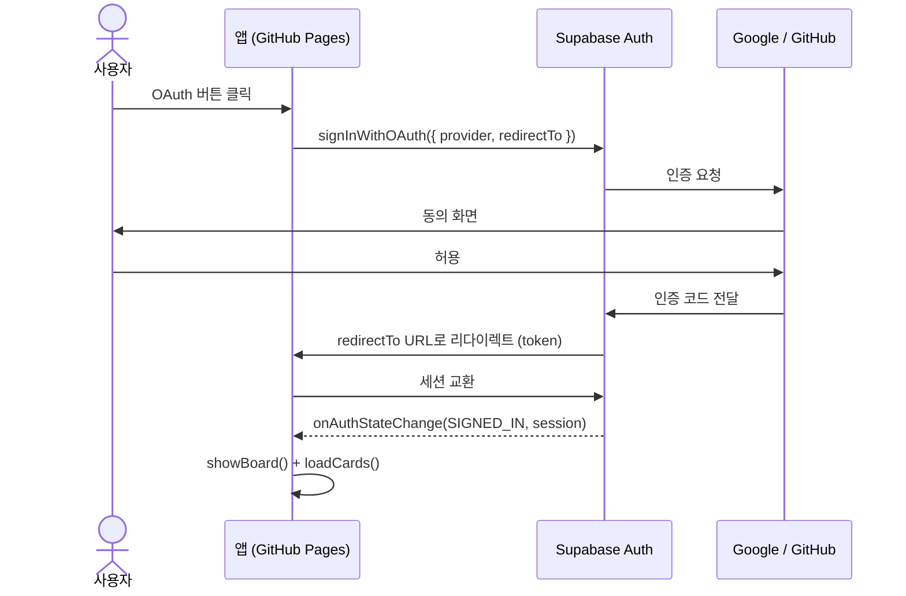
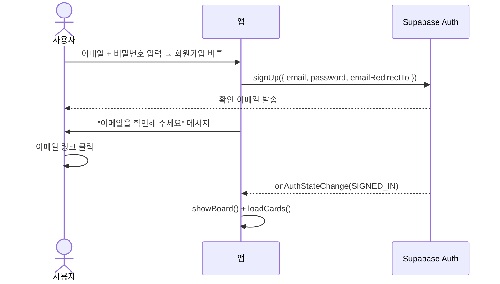
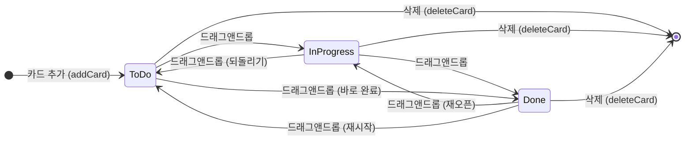
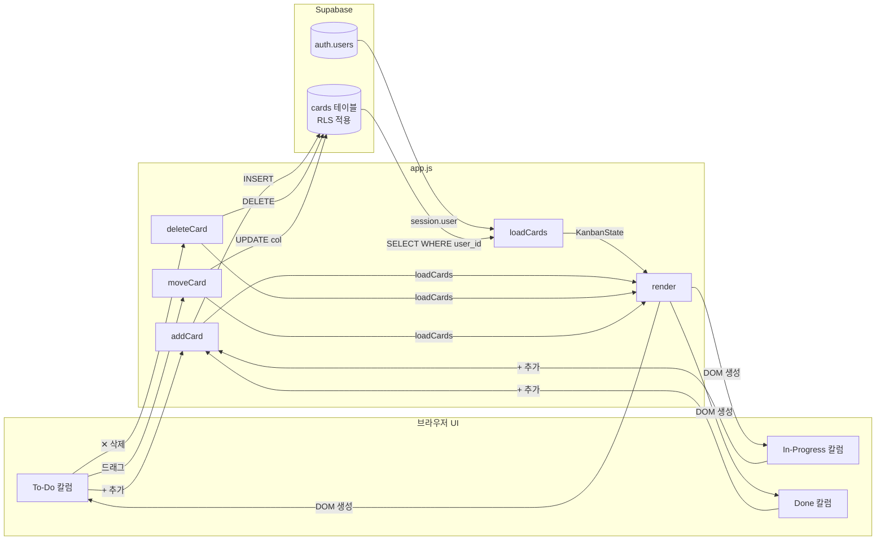

# USERFLOW — 사용자 흐름도

> 프로젝트: Kanban Board  
> 작성일: 2026-05-20  
> 작성자: Kangsoo.Lee  
> 버전: 2.0.0

---

## 1. 전체 앱 흐름 (App Flow)

```mermaid
flowchart TD
    START([브라우저 접속\nhttps://kangsoo-lee2.github.io/kanban/])
    START --> SESSION{onAuthStateChange\n세션 확인}

    SESSION -->|세션 있음| BOARD[칸반 보드 표시\nloadCards 호출]
    SESSION -->|세션 없음| AUTH[인증 화면 표시]

    AUTH --> CHOOSE{로그인 방법 선택}
    CHOOSE -->|Google| GOOGLE[signInWithOAuth\nprovider: google]
    CHOOSE -->|GitHub| GITHUB[signInWithOAuth\nprovider: github]
    CHOOSE -->|이메일 로그인| EMAILIN[signInWithPassword]
    CHOOSE -->|이메일 회원가입| EMAILUP[signUp]

    GOOGLE --> REDIRECT[공급자 동의 화면\n→ redirectTo로 복귀]
    GITHUB --> REDIRECT

    REDIRECT --> SESSION
    EMAILIN -->|성공| BOARD
    EMAILIN -->|실패| ERR1[오류 메시지 표시]
    EMAILUP -->|이메일 미확인| MAIL[확인 이메일 안내]
    EMAILUP -->|즉시 확인| BOARD
    ERR1 --> AUTH
    MAIL --> AUTH

    BOARD --> LOAD[Supabase cards 조회\nuser_id = 현재 사용자]
    LOAD --> RENDER[보드 렌더링\n3칼럼 + 카드 + 배지]
    RENDER --> IDLE{대기 중\n사용자 액션}

    IDLE -->|카드 추가| ADD_FLOW
    IDLE -->|카드 드래그| DRAG_FLOW
    IDLE -->|삭제 버튼| DEL_FLOW
    IDLE -->|로그아웃| LOGOUT[signOut → 인증 화면]

    subgraph ADD_FLOW [카드 추가]
        A1[텍스트 입력] --> A2{Enter 또는\n추가 버튼}
        A2 --> A3{입력값 비어있음?}
        A3 -->|Yes| A4[무시]
        A3 -->|No| A5[Supabase INSERT cards]
        A5 --> A6[loadCards → render]
    end

    subgraph DRAG_FLOW [드래그앤드롭]
        D1[dragstart: card id·col 저장] --> D2[dragover: 드롭 영역 강조]
        D2 --> D3{같은 칼럼?}
        D3 -->|Yes| D4[무시]
        D3 -->|No| D5[Supabase UPDATE col=destCol]
        D5 --> D6[loadCards → render]
    end

    subgraph DEL_FLOW [카드 삭제]
        X1[✕ 버튼 클릭] --> X2[Supabase DELETE WHERE id=...]
        X2 --> X3[loadCards → render]
    end

    A6 --> IDLE
    D6 --> IDLE
    D4 --> IDLE
    A4 --> IDLE
    X3 --> IDLE
```



---

## 2. 인증 흐름 상세

### 2.1 OAuth (Google / GitHub)



### 2.2 이메일 회원가입



---

## 3. 카드 상태 전이도



모든 상태 전이는 Supabase DB에 즉시 반영됨.

---

## 4. 데이터 저장 흐름



---

## 5. 오류 처리 흐름

```mermaid
flowchart TD
    AUTH_REQ[인증 시도] --> TRY1{Supabase 응답}
    TRY1 -->|성공| OK1[세션 생성 → showBoard]
    TRY1 -->|실패| ERR1[showMessage 오류 표시]

    CARD_ADD[카드 추가 시도] --> TRY2{Supabase INSERT}
    TRY2 -->|성공| OK2[loadCards → render]
    TRY2 -->|실패 (RLS 등)| ERR2[console.error, 무시]

    CARD_DEL[카드 삭제 시도] --> TRY3{Supabase DELETE}
    TRY3 -->|성공| OK3[loadCards → render]
    TRY3 -->|실패| ERR3[console.error, 무시]

    DRAG_DROP[드롭 이벤트] --> TRY4{dataTransfer JSON 파싱}
    TRY4 -->|성공| TRY5{Supabase UPDATE}
    TRY4 -->|실패| IGNORE[return]
    TRY5 -->|성공| OK4[loadCards → render]
    TRY5 -->|실패| ERR4[console.error, 무시]
```
